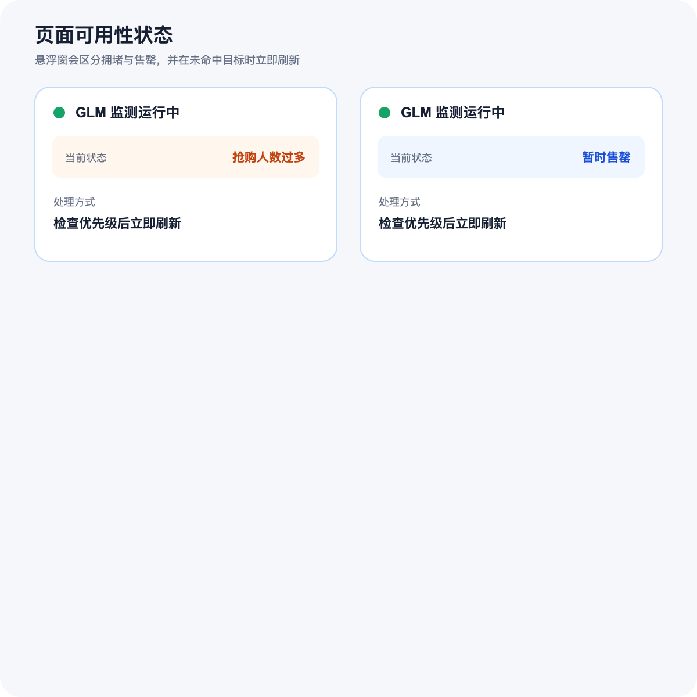

# GLM Coding 抢购监测助手 Pro

Chrome Manifest V3 扩展，用于监测 GLM Coding 套餐页面。它能读取月付、季付、年付方案，按用户设置的优先级检查目标套餐；没有可购买目标时立即刷新，发现可购买按钮后只点击一次并停止刷新。

> 当前版本：**1.0.2**。本项目不能保证购买成功，也不会绕过登录、验证码、排队、限流、风控、订单确认或支付确认。

## 当前功能

- 自动读取月付、季付、年付，共 9 个套餐变体，并在读取后恢复页面原周期。
- 同时选择多个目标套餐，使用上移、下移和移除调整抢购优先级。
- 使用套餐名称、订阅周期和价格精确匹配，不用相似套餐替代目标。
- 页面 DOM 变化时立即检查，并提供 100ms、200ms、500ms 兜底检测模式。
- 完整检查一轮优先级；没有可购买目标时立即刷新，不等待倒计时。
- 区分“抢购人数过多”和“暂时售罄”，并显示在网页右上角悬浮窗。
- 获得后台单次点击权后点击目标按钮一次；点击后立即停止刷新，随后显示“已自动点击，刷新已停止”。
- 页面自动刷新后恢复悬浮窗、刷新次数和停止按钮。
- 支持声音提醒、Chrome 桌面通知和最多 200 条本地日志。
- 扩展更新后若原页面脚本断联，读取套餐会自动重新注入并重试。

## 功能截图

### 套餐总览


点击“刷新全部套餐”后，插件依次读取月付、季付和年付方案。不可购买的套餐仍会显示，状态标记为“不可用”。

### 套餐筛选与优先级


可按周期筛选方案，并同时勾选多个目标。抢购时从优先级队列顶部开始依次检查。

### 监测设置


稳健、平衡和冲刺模式分别使用 500ms、200ms 和 100ms 兜底检测。冲刺模式最多运行 5 分钟，然后自动恢复平衡模式。

### 页面悬浮窗


悬浮窗显示当前页面状态、真实刷新次数和检测间隔，并提供不依赖插件弹窗的“停止监测”按钮。

### 不可购买状态



“抢购人数过多，请刷新再试”“购买人数过多”和“暂时售罄”都会先执行正常套餐优先级检查；存在可购买目标时优先点击，否则立即刷新。

## 安装与更新

1. 使用 [Download ZIP](https://github.com/zkilxx/glm-coding-watcher-pro/archive/refs/heads/main.zip) 下载仓库并解压。
2. Chrome 打开 `chrome://extensions/`。
3. 开启“开发者模式”。
4. 点击“加载已解压的扩展程序”。
5. 选择包含 `manifest.json` 的仓库根目录。
6. 确认扩展卡片显示版本 **1.0.2**。

从源码安装时不需要构建：克隆仓库后直接加载仓库根目录即可。

更新版本时，请重新下载并完整解压，避免继续加载旧目录。若 Chrome 仍显示旧版本，在扩展管理页移除旧扩展，再重新加载新版目录。

## 使用方法

1. 登录 BigModel，并打开 `https://bigmodel.cn/glm-coding`。
2. 打开扩展，点击“刷新全部套餐”。
3. 确认界面显示“已读取 9 个套餐变体”。
4. 勾选一个或多个可接受的套餐。
5. 在“抢购优先级”中调整顺序。
6. 选择稳健、平衡、冲刺或自定义检测间隔。
7. 点击“开始监测”。
8. 命中后返回网页，手动完成验证、订单确认和支付。

未选择目标套餐时不能开始监测。每次点击“开始监测”会创建一轮新的运行状态；同一时间只允许一个 GLM Coding 标签页保持活动监测。

## 工作流程

```text
读取三种订阅周期
        ↓
按优先级检查目标套餐
        ↓
有可购买目标？ ── 是 ─→ 申请单次点击权 → 点击一次 → 停止刷新
        │
        否
        ↓
显示抢购人数过多或暂时售罄
        ↓
记录刷新次数并立即刷新
```

套餐页面尚未渲染完成时会等待页面加载；如果页面已经出现“抢购人数过多”，即使套餐卡未完整加载也会立即刷新。

## 悬浮窗状态

- **检查套餐中**：正在读取页面或遍历目标优先级。
- **抢购人数过多**：页面出现抢购或购买人数过多提示。
- **暂时售罄**：目标区域的按钮显示暂时售罄或售罄。
- **发现可购买套餐**：找到符合优先级和精确匹配规则的可用目标。
- **已自动点击，刷新已停止**：已完成唯一一次自动点击，等待用户手动处理后续步骤。

## 权限说明

- `storage`：在本机保存设置、运行状态和日志。
- `notifications`：点击目标后显示桌面通知。
- `tabs`：读取当前标签页并发送监测状态。
- `scripting`：扩展更新后，在受支持页面脚本断联时重新注入当前内容脚本。
- `https://bigmodel.cn/glm-coding*`：仅允许在 GLM Coding 页面运行监测逻辑。

## 安全边界

扩展不会：

- 绕过、识别或自动处理验证码；
- 自动登录或读取账号密码；
- 绕过排队、限流或风控；
- 调用隐藏、私有或未公开的购买接口；
- 自动确认订单、支付或确认支付；
- 向第三方上传页面内容、日志、账号信息或浏览数据。

连续快速刷新可能触发平台限制或安全验证。请遵守网站条款，并根据实际情况控制使用时长。

## 故障排查

### 读不出套餐

1. 确认当前活动标签页是 `https://bigmodel.cn/glm-coding`。
2. 在 `chrome://extensions/` 确认插件版本为 **1.0.2**。
3. 如果仍显示 1.0.0，说明 Chrome 加载的是旧解压目录；移除旧扩展后重新加载新版目录。
4. 返回 GLM 页面，再点击“刷新全部套餐”。新版会在内容脚本断联时自动重新注入并重试。

### 页面刷新后无法停止

网页右上角悬浮窗会在刷新后重新出现。直接点击悬浮窗中的“停止监测”，无需保持插件弹窗打开。

### 套餐状态与页面不一致

网站可能修改了套餐卡、按钮文字或周期控件。请提交 issue，并附上去除个人信息后的页面截图、按钮文字和插件版本号。

### 没有声音或桌面通知

检查 Chrome 与系统通知权限。提醒失败不会解除单次点击锁，也不会导致重复点击。

## 本地验证

需要 Node.js 20 或更高版本：

```bash
npm test
node --check background.js
node --check content.js
node --check popup.js
```

## 隐私

配置、运行状态和日志仅保存在 `chrome.storage.local`。项目不包含分析、追踪、远程代码或网络上报。

## 许可证

[MIT](LICENSE)
