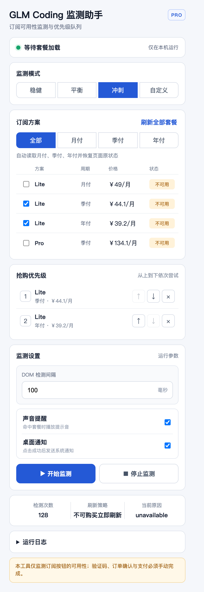
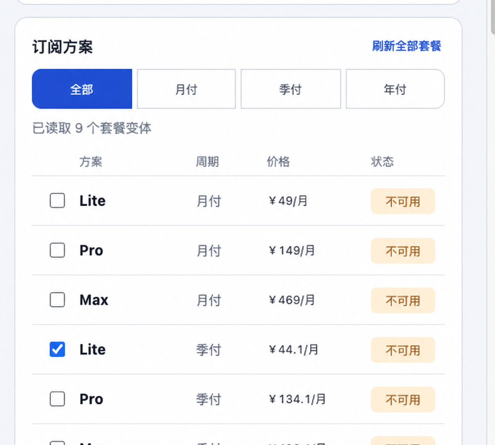
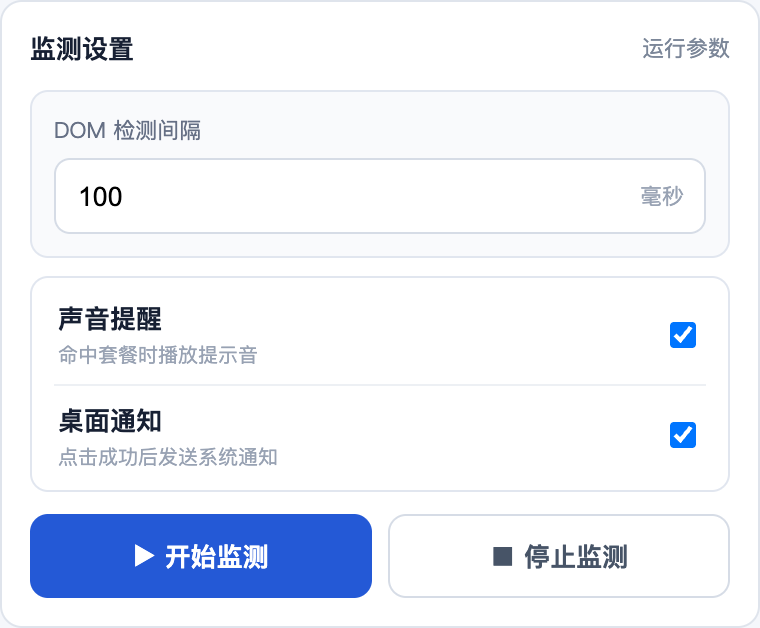
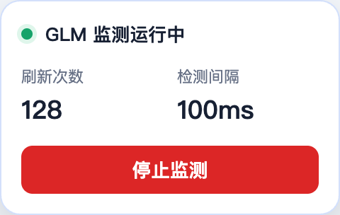

# GLM Coding 抢购监测助手 Pro

一个透明、无依赖的 Chrome Manifest V3 扩展，用于低频监测 GLM Coding 购买页面。发现可用购买按钮后，扩展只点击一次并立即停止，验证码、登录、排队、支付和支付确认均由你手动完成。

> 本项目不能保证购买成功，也不会绕过限流、风控或其他平台规则。请合理设置间隔并遵守网站条款。

## 演示视频

[](dist/glm-coding-watcher-demo.mp4)

点击封面观看约 60 秒的 1080p 操作与功能演示，包含套餐选择、抢购优先级、监测设置、刷新计数和单次点击流程。

## 功能

- `MutationObserver` 在按钮变化时立即检测，并以最快 100ms 兜底扫描
- 等待套餐卡片和月付、季付、年付控件渲染完成，避免页面未加载就误刷新
- 监测运行时在网页右上角显示状态卡、真实刷新次数和“停止监测”按钮，自动刷新后会重新出现
- 启动监测后，完整检查一轮优先级队列；没有可购买目标就立即刷新，不等待倒计时
- 稳健、平衡、冲刺三种预设；冲刺模式最多运行 5 分钟
- 将“抢购人数过多，请刷新再试”和“购买人数过多”按售罄状态处理
- 按钮可用时经过后台原子确认后单次点击
- 本地声音和 Chrome 桌面通知
- 最多保留 200 条本地日志
- 每次手动启动生成新运行状态，点击后防重复锁定
- 获得点击权后立即停止刷新，再执行一次点击

## 功能截图

### 插件主界面



主界面集中展示运行状态、监测模式、订阅方案、抢购优先级、监测设置和检测日志。

### 订阅方案与抢购优先级



支持读取月付、季付和年付套餐，同时勾选多个目标，并按从上到下的顺序设置抢购优先级。

### 监测设置



可以调整 DOM 检测间隔，并分别控制声音提醒和桌面通知；开始与停止按钮采用等宽布局。

### 页面运行状态卡



监测运行时，网页右上角显示真实刷新次数、检测间隔和停止按钮；页面刷新后会自动恢复。

## 时间模式

- **稳健**：500ms DOM 兜底检测。
- **平衡（默认）**：200ms DOM 兜底检测。
- **冲刺**：100ms DOM 兜底检测，最多 5 分钟后自动恢复平衡。

出现“抢购人数过多，请刷新再试”“购买人数过多”或目标按钮售罄时，插件仍会先完成当前优先级检查：发现可购买目标就单次点击并停止刷新；没有可购买目标则立即刷新。连续刷新可能触发平台限制或安全验证，请自行控制使用时长。

## 选择目标套餐

1. 打开 GLM Coding 页面后，在弹窗点击“刷新全部套餐”。插件会依次读取月付、季付、年付并恢复原周期。
2. 同时勾选一个或多个可接受的订阅版本。
3. 在“抢购优先级”中使用上移、下移或移除，从上到下排列。
4. 监测时会跳过不可用套餐，点击当前可购买目标中优先级最高的一个。

套餐使用名称和价格精确匹配。目标消失或页面信息含糊时不会用相似套餐代替；未选择目标套餐时无法开始监测。点击任一目标后，其他目标全部锁定。

## 安全边界

扩展只操作当前网页中可见的普通按钮，不会：

- 绕过或识别验证码；
- 自动登录、读取账号密码或接管身份验证；
- 绕过排队、限流或风控；
- 调用隐藏、私有或未公开的购买接口；
- 自动支付或确认支付；
- 向第三方上传浏览数据、页面内容、日志或账号信息。

## 安装

### 从 GitHub 下载

1. 在仓库页面点击 **Code → Download ZIP**。
2. 解压 ZIP。
3. Chrome 打开 `chrome://extensions/`。
4. 开启右上角“开发者模式”。
5. 点击“加载已解压的扩展程序”。
6. 选择解压目录中包含 `manifest.json` 的文件夹。

### 从源码安装

克隆仓库后，直接在 `chrome://extensions/` 中加载仓库根目录，无需安装依赖或构建。

## 使用

1. 登录 BigModel，并打开 `https://bigmodel.cn/glm-coding`。
2. 点击扩展图标。
3. 设置 DOM 检测间隔；启动后，未命中目标套餐就会立即刷新。
4. 点击“开始监测”。
5. 扩展发现按钮可用时仅点击一次、停止监测并通知你。
6. 返回页面，手动处理验证码、订单确认和支付。

再次点击“开始监测”会创建一轮新的监测。请勿同时打开大量标签页或设置激进间隔。

## 权限说明

- `storage`：在本机保存设置、运行状态和日志。
- `notifications`：按钮点击后显示桌面通知。
- `tabs`：读取当前标签页，并向受支持页面发送监测状态。
- `https://bigmodel.cn/glm-coding*`：仅在 GLM Coding 页面注入监测脚本。

## 故障排查

- **提示先打开页面**：确认当前标签页地址以 `https://bigmodel.cn/glm-coding` 开头。
- **按钮已可用但未识别**：网站可能修改了按钮文案或页面结构，请提交 issue，并附去除个人信息后的截图与按钮文字。
- **没有桌面通知**：检查系统和 Chrome 通知权限；通知失败不会导致重复点击。
- **刷新后仍在监测**：运行状态保存在本机；成功点击后立即停止刷新并锁定第二次点击。

## 本地验证

需要 Node.js 20 或更高版本：

```bash
npm test
node --check background.js
node --check content.js
node --check popup.js
```

## 隐私

所有配置和日志保存在 `chrome.storage.local`。项目不包含网络上报、分析、追踪或远程代码。

## 许可证

[MIT](LICENSE)
